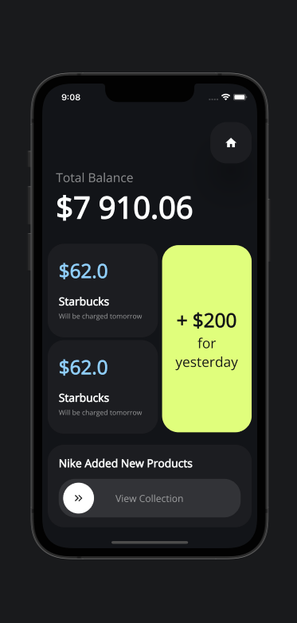
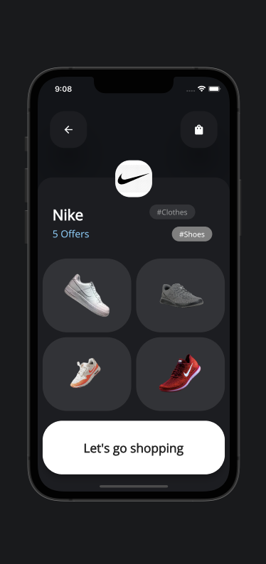

# Table of Content
* `General information`
* `App Screenshots`
* `Design Source`

## General Information
This projects contains a flutter app of Cashback App Design from dribble (source below).

✨ The Home Screen consists of:
    the balance,
    the button that you can use to scan the receipt,
    the accrual block,
    and the offer block.

✨ The Shop Screen displays:
    the shop details,
    a few products,
    and the Let's Go Shopping 🛍️ button.

## Screenshots

![app] (assets/app_screenshots/buy_item_page.png)

## Design Source

